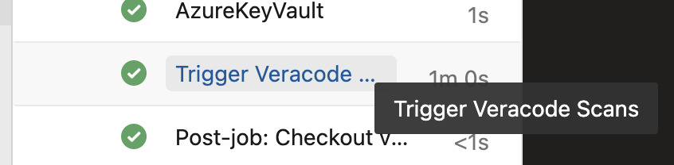
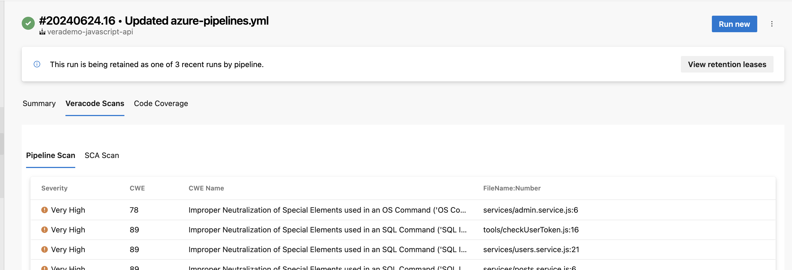

# Veracode Workflow Extension

## Overview

This extension aims to simplify the integration of Veracode Static Analysis and/or Veracode Software Composition Analysis into your pipelines. It facilitates the execution of Policy Scans and Pipeline Scans for Static Analysis, as well as Agent-Based Scans for Software Composition Analysis. Additionally, setting up Azure Key Vault is necessary as the extension requires additional secrets to execute the scans.

## Getting Started

1. The user needs to generate a Personal Access Token (PAT) with the following permissions: 
    - Extensions: Read & manage 
    - Code(Read Write and Manage);
2. Steps to install the extension from UI
    - Choose the Azure tile. 
    - Enter the PAT generated from the previous step.
    - Enter the name of the organization where you wish to install this extension, then click on "Install."
3. We'll set up a Veracode project within your organization where you've installed the extension. In this project, we'll import the Veracode repository containing the veracode.yml file.
4. Once the extension is installed and the Veracode project is set up, you will need to create an Azure Vault and a service connection.
    
5. Create a Azure key vault

    Below are the secrets need to be set

    | Secret Name | Required | Description |
    | ----------- | ----------- | ----------- |
    | UserPat | *Required* |  Generate a PAT (Personal Access Token) with the permission to read code. The extension requires this access to retrieve repository details for triggering scans. |
    | VeracodeApiId | *Required* | The ID part of your Veracode API Credentials. You can generate these credentials from [Veracode Platform](https://analysiscenter.veracode.com/auth/index.jsp#APICredentialsGenerator), refer [Doc]((https://docs.veracode.com/r/t_create_api_creds)) |
    | VeracodeApiKey | *Required* | The Key part of your Veracode API Credentials. You can generate these credentials from [Veracode Platform](https://analysiscenter.veracode.com/auth/index.jsp#APICredentialsGenerator), refer [Doc]((https://docs.veracode.com/r/t_create_api_creds))|
    | ScaApiToken | *Required* | The API Token for Agent Base SCA scanning. For more details refer [Doc](https://docs.veracode.com/r/Regenerate_Veracode_SCA_Agent_Tokens)  |
    | SrcclrApiUrl | *Required* | The URL for the SCA Endpoints. This is based on the Veracode Region you are using. For Commerical (US) the url is https://api.sourceclear.io For European the url is https://platform-backend.analysiscenter.veracode.eu  |
    
6. Create a service connection
    - Sign in to your Azure DevOps organization, and then navigate to veracode project.
    - Select Project settings > Service connections, and then select New service connection to create a new service connection.
    - Select Azure Resource Manager, and then select Next.
    - Select Service principal (automatic), and then select Next.
    - Select Subscription and Resource group from the drope down.
    - The service connection should be named 'Veracode Service Connection'. Then, select the 'Grant access permission to all pipelines' checkbox and click on Save.
    - Click on the 'Veracode Service Connection', then click on the three dots (More Actions) in the top-right corner > Security > Project permissions.
    - Share this newly created service connection with other projects where you want to integrate Veracode scans using the extension.

## How scanning works

In your `veracode.yml` file, You can apply several configurations, including:
- The types of scans to run
- Which branches to target
- Which Veracode security policy to apply
- Whether the scan is triggered by a push or a pull

See the [full list of available configurations](#veracodeyml-configurations).

By default, your `veracode.yml` file is configured with the following scan triggers:
- Static pipeline scan on any push activity on any branch
- SCA agent-based scan on any push activity on any branch

If you [set `analysis_on_platform` to `true`](#veracodeyml-configurations), these additional scans are triggered by default: 
- Policy scan, which sends results to the Veracode Platform, after code is merged into your `analysis_branch`

You can configure all of these to fit your own organization's process by editing the `veracode.yml` file.

### Specify repositories to scan

By default, the GitHub Workflow Integration scans all repositories except for the `veracode` repository.

#### Exclude specific repositories

1. Open `repo_list.yml` in the `veracode` repository.
2. Under `exclude_repos:` enter the list of repositories you want to exclude. Each repository name must be surrounded by single quotes. For example: `'java_Repo'`

#### Include only specific repositories

1. Open `repo_list.yml` in the `veracode` repository.
2. Under `include_repos:` enter the list of repositories you want to include. Each repository name must be surrounded by single quotes. For example: `'java_Repo'`
3. If the list includes `'*'`, delete it. If it is present, Veracode will scan all repositories that are not listed under `exclude_repos:`.

### `veracode.yml` configurations

In your `veracode.yml` file, you can configure the following values to customize the integration:

| Value                              | Description                                                                                                                                                                                                                                                   | Default value                                                                                         |
|------------------------------------|---------------------------------------------------------------------------------------------------------------------------------------------------------------------------------------------------------------------------------------------------------------|-------------------------------------------------------------------------------------------------------|
| `push`:`trigger`                   | If `true`, a pipeline scan is triggered when you commit changes to a branch.                                                                                                                                                                                  | `true`                                                                                                |
| `push`:`branches_to_run`           | The branches that trigger pipeline scans when you commit changes. If `'*'`, all branches can trigger scans.                                                                                                                                                   | `'*'`                                                                                                 |
| `push`:`branches_to_exclude`       | The branches that do not trigger scans. Only applies if `branches_to_run` is set to `'*'`.                                                                                                                                                                    |                                                                                                       |
| `pull_request`:`trigger`           | If `true`, a scan is triggered when you perform a pull request action.                                                                                                                                                                                        | `true`                                                                                                |
| `pull_request`:`action`            | Pull request actions that trigger scans. Valid values are: `opened`, `reopened`, `edited`, `synchronize`, `closed`.                                                                                                                                           | `opened` and `synchronize`                                                                            |
| `pull_request`:`target_branch`     | The target branch that triggers scans when you perform pull request actions.                                                                                                                                                                                  | `default_branch`                                                                                      |
| `analysis_branch`                  | The branch submitted to the Veracode Platform for analysis. If you do not enter a valid branch name, Veracode uses the default branch.                                                                                                                        | `default_branch`                                                                                      |
| `analysis_on_platform`             | If `false`, no scans are submitted to the Veracode Platform. If `true`, scans from the `analysis_branch` are submitted to the Platform, creating an [application profile](https://docs.veracode.com/r/request_profile) that has the repository's name. | `false`                                                                                               |
| `policy`                           | The [application security policy](https://docs.veracode.com/r/c_appsec_policies) applied to your scan findings, if a policy is not already assigned to your application profile.                                                                                    | `'Veracode Recommended Medium + SCA'`                                                                 |

## How to verify scan
After configuring, based on your setup, you will find the "Trigger Veracode Scans" task available in your build pipeline. 
On the pipeline tab, you can access the complete report.

 
 